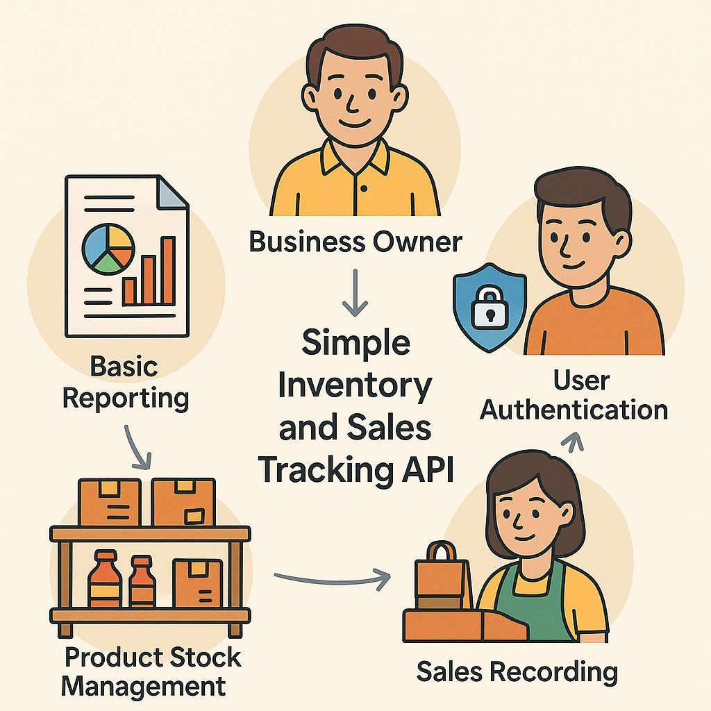

# 🛒 Simple Inventory and Sales Tracking API

A lightweight, FastAPI-based REST API for managing inventory, sales transactions, and reporting for small retail shops. This project is built to demonstrate practical CRUD operations, user authentication, and basic reporting using modern Python frameworks.



---

## 🚀 Features

- **User Authentication**
  - Register and login with hashed passwords and JWT tokens.
- **Product Management**
  - Add, edit, delete, and list products with stock levels.
- **Sales Recording**
  - Record product sales with date and quantity.
- **Basic Reporting**
  - Daily and weekly sales summaries.
- **Optional Extras**
  - Soft delete products
  - Sale rollback
  - Inventory threshold alerts
  - User roles (admin vs regular users)

---

## 📖 API Endpoints

### 📦 Users

- `GET /users/` — List all Users
- `POST /users/` — Add a new user.
- `PUT /users/email/{user_name}` — Get specific User.
- `PUT /users/email/{user_name}` — Update user details.
- `DELETE /users/{user_name}` — Remove a user.

### 📦 Products

- `GET /products/` — List all products.
- `POST /products/` — Add a new product.
- `PUT /products/{product_id}` — Update product details.
- `DELETE /products/{product_id}` — Remove a product.

## 🛠️ Tech Stack

- [FastAPI](https://fastapi.tiangolo.com/) — API framework
- [SqlAchemy](https://pypi.org/project/SQLAlchemy/) / SQLAlchemy — ORM for database models
- [Ms server](https://www.microsoft.com/en-us/sql-server/sql-server-downloads) — Simple local database
- [Pydantic](https://docs.pydantic.dev/) — Data validation
- [Passlib](https://passlib.readthedocs.io/en/stable/) — Password hashing
- [PyJWT](https://pyjwt.readthedocs.io/en/stable/) — JWT authentication
- Docker (optional for containerization)

---

## 📦 Installation

```bash
# Clone the repository
git clone https://github.com/mugabi91/inventory-sales-api.git
cd inventory-sales-api

# Create a virtual environment
python -m venv venv
source venv/bin/activate  # On Windows: venv\Scripts\activate

# Install dependencies
pip install -r requirements.txt

# Run the application
uvicorn App.main:app --reload
